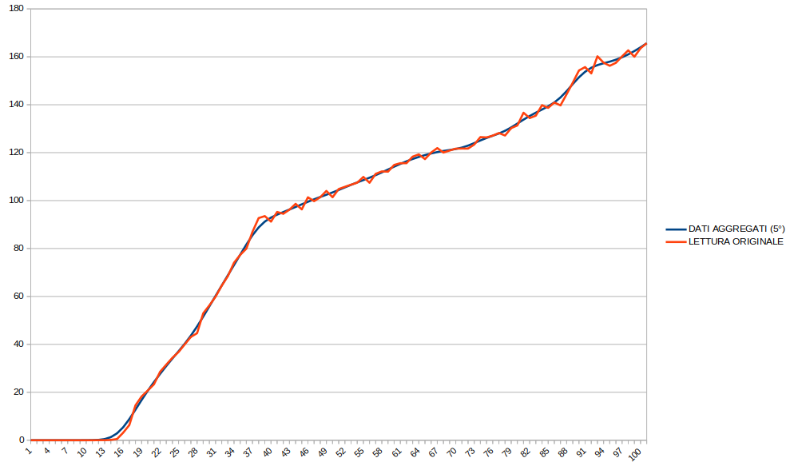

# Wheel check data aggregator

***Wheel check data aggregator*** is a usefull tool that helps you to improve log files generated using [***Wheel check***]() by aggregating data in order to emphasizing the behavior of your steering wheel and eliminating reading errors.

...but what does it mean? what is data aggregation?

## Data Aggregation example (with Logitech G29)

