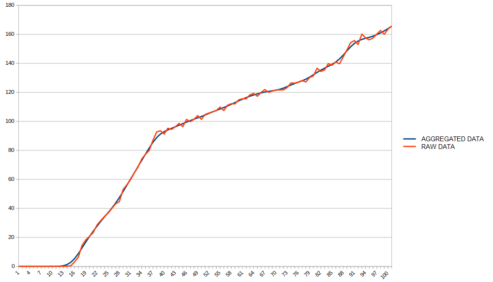

# Wheel Check Data Aggregator

***Wheel check data aggregator*** is a usefull tool that helps you to improve log files generated using [***Wheel check***](https://www.racedepartment.com/downloads/lut-generator-for-ac.9740/) by aggregating data in order to emphasizing the behavior of your steering wheel and eliminating reading errors.

...but what does it mean? what is data aggregation?

## Data Aggregation example (with Logitech G29)

In the following example you can see an example of a generated log file for a ***Logitech G29***. The red line represent the raw data generated by [***Wheel check***](https://www.racedepartment.com/downloads/lut-generator-for-ac.9740/) while the blue line is the output log file generated by ***Wheel Check Data Aggregator***.

Data aggregation is a widely used process that helps to extract the behavior of a set of raw data by eliminating reading errors. It's used mostly in advanced security and control systems (sensors networks, allarms). 

With this utility, you can choose the degree of data aggregation

