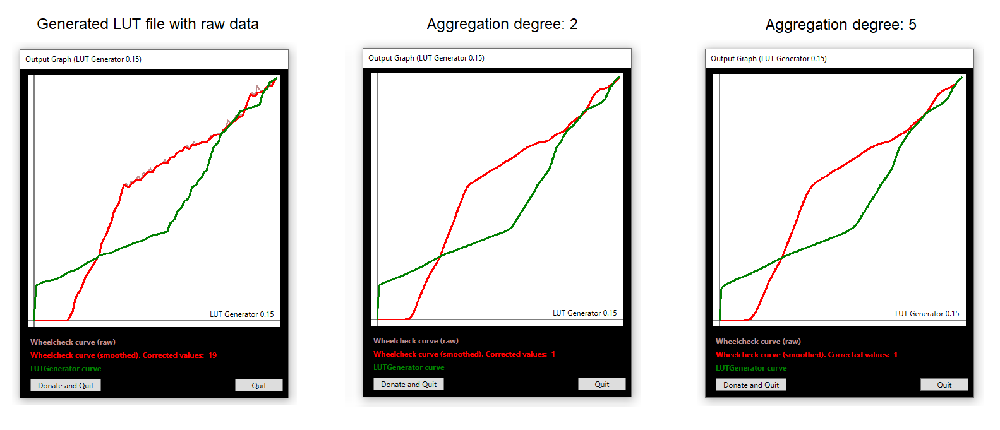

# Wheel Check Data Aggregator

[***Wheel Check Data Aggregator***](https://github.com/Luke460/wheel-check-data-aggregator/releases) is a useful tool that helps to improve the behavior of your steering wheel by aggregating data and eliminating reading errors.

This procedure use as input a log file generated by ***Wheel Check***, and by processing it, is able to produce either an improved log file or an improved ***lut file***.

...but what does it mean? what is data aggregation?

## Data Aggregation example

Data aggregation is a widely used process that helps to extract the behavior of a set of raw data by mitigating reading errors. It's used mostly in advanced security and control systems (sensors networks, alarms). 

In the following graph you can see an example of a generated log file for a ***Logitech G29***. The red line represents the raw data collected by the standard ***Wheel Check*** calibration procedure, while the blue line is the dataset generated by ***Wheel Check Data Aggregator*** used in this example for the generation of an improved lookup table (or ***lut file***).

## Let's aggregate!

Before to start, you have to execute a calibration procedure by using ***Wheel Check***, a tool made by David Tucker of iRacing.com that measures the change in the steering wheel position for each input applied.
I recommend to execute a ***Step Log 2 (linear force test)*** with ***Max Count*** set to ***100***.

To run ***Wheel Check Data Aggregator***, download the [***latest version***](https://github.com/Luke460/wheel-check-data-aggregator/releases), unzip the file and run ***WheelCheckDataAggregator.jar*** (requires Java 7 or later):

Now you have to locate your ***Wheel Check***'s log file and choose the degree of data aggregation (named ***aggregation order***):
   
| **Steering wheel type** | ***Example*** | **Aggregation order**              | **FFB peak reduction** | **dead zone enhancement** (depends on your wheel dead zone) |
|-------------------------|------------------------------|------------------------------------|------------------------|-------------------------------------------------------------|
| ***direct wheels***     | Fanatec Podium DD2           | 2                                  | 0                      | 0                                                           |
| ***belt wheels***       | Thrustmaster T300            | 3                                  | 0                      | 0                                                           |
| ***mixed wheels***      | Thrustmaster TXM or T150     | 4                                  | from 0 to 5            | 0                                                           |
| ***geared wheels***     | Logitech G29 or G27          | activate ***generate linear lut*** | from 5 to 10           | 5                                                           |

  Every steering wheel is different, you may need to find the perfect *aggregation order* for your device!
  - Recommended values are between 2 and 6. (3 is always a good starting point).
 
 **NOTE:** these tips are based on a test with 100 reading values (*Wheel Check: Max Count=100*). If you are using a higher *Max Count* consider to increment the ***aggregation order*** as well (and vice versa).

 **IN GENERAL** : lower values makes your force feedback correction more precise, while higher values makes your force feedback smoother.
 - Don't go too high, or you will lose precision in force feedback correction.
 - Don't go too low or you will not benefit of the aggregation procedure.
 - You can click on ***auto*** to (hopefully) calculate a good aggregation order for your steering wheel.
 - You can use ***FFB peak reduction*** if you have clipping issues with your steering wheel or simply you want to reduce the effects of very rough curbs, bumps, strong vibrations, etc. Enabling this option may also slightly reduce the overall noise of your steering wheel and extend its lifespan. Highly recommended for geared wheels.
 - You can use ***dead zone enhancement*** if you have vibrations in the central area of the steering wheel.
 - Experiment and play with the ***preview*** button!
 

Now click on ***Generate csv*** or ***Generate lut*** (depending on the purpose for which you will use this application) and if everything goes well, you should get the following output message:

**DONE:** The generated file is located in the *Wheel Check Data Aggregator* folder.

---

You can also use generated csv files as [***LUT Generator for AC***](https://www.racedepartment.com/downloads/lut-generator-for-ac.9740/) input, but from version v2.2 you can directly generate your lut file from ***Wheel Check Data Aggregator***.

Keep in mind that my algorithm may not be the same, so the result may change a little as well.

## DOWNLOADS

 + [***Wheel Check Data Aggregator***](https://github.com/Luke460/wheel-check-data-aggregator/releases) ***(latest version)***
 
 ---
 
## New Features

 - [v1.5](https://github.com/Luke460/wheel-check-data-aggregator/releases): Multiple Spike detection and correction:

- [v1.7](https://github.com/Luke460/wheel-check-data-aggregator/releases): Error correction improvement:

- [v2.0](https://github.com/Luke460/wheel-check-data-aggregator/releases): Added user interface and output graph comparison:

- [v2.2](https://github.com/Luke460/wheel-check-data-aggregator/releases): Added direct lut generation feature.

- [v2.3](https://github.com/Luke460/wheel-check-data-aggregator/releases): Added 'Auto' button to suggest an aggregation order based on the given csv file.

- [v2.4](https://github.com/Luke460/wheel-check-data-aggregator/releases): Higher lut file output resolution.

- [v2.5](https://github.com/Luke460/wheel-check-data-aggregator/releases): Added 'Dead zone enhancement' option (not needed on most steering wheels).

- [v2.6](https://github.com/Luke460/wheel-check-data-aggregator/releases): Improved 'Dead zone enhancement': slider added.

- [v2.8](https://github.com/Luke460/wheel-check-data-aggregator/releases): Added option to perform dead zone correction only.

- [v2.9](https://github.com/Luke460/wheel-check-data-aggregator/releases): Added 'FFB peak reduction' feature.
