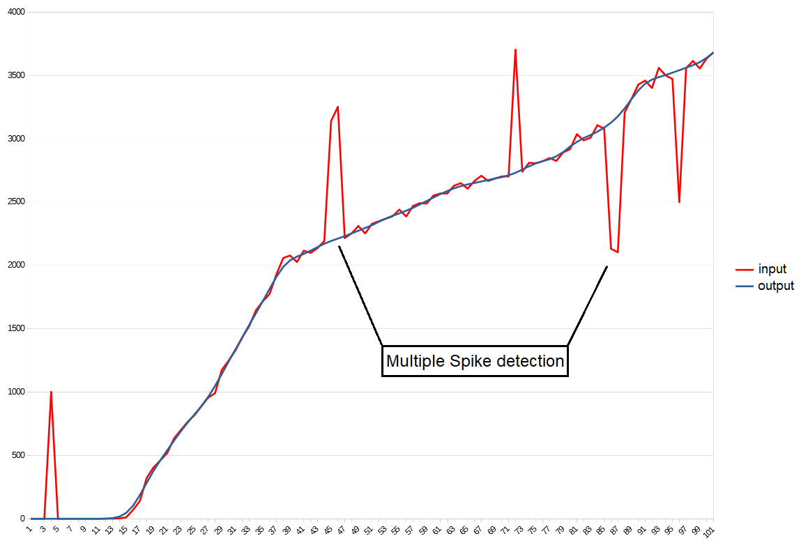
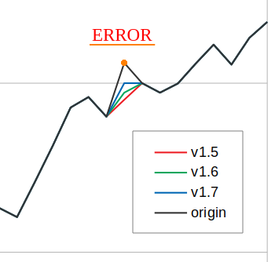

# Wheel Check Data Aggregator

[***Wheel Check Data Aggregator***](https://github.com/Luke460/wheel-check-data-aggregator/releases) is a useful tool that helps to improve the behavior of your steering wheel by aggregating data and eliminating reading errors.

This procedure use as input the [***Wheel check***](https://www.racedepartment.com/downloads/lut-generator-for-ac.9740/)'s log files and by processing them is able to produce an improved log file. Then you can use this file as *Lut Generator* input to improve generated lut files and thus also the behavior of your wheel.

...but what does it mean? what is data aggregation?

## Data Aggregation example (with Logitech G29)

Data aggregation is a widely used process that helps to extract the behavior of a set of raw data by mitigating reading errors. It's used mostly in advanced security and control systems (sensors networks, alarms). 

In the following graph you can see an example of a generated log file for a ***Logitech G29***. The red line represents the raw data collected by the standard [***Wheel check***](https://www.racedepartment.com/downloads/lut-generator-for-ac.9740/) calibration procedure, while the blue line is the improved output file generated by ***Wheel Check Data Aggregator***.

To run the utility, just execute ***WheelCheckDataAggregator.jar***:

Now you have to locate your [***Wheel check***](https://www.racedepartment.com/downloads/lut-generator-for-ac.9740/)'s log file and choose the degree of data aggregation (named ***aggregation order***):

 - For geared wheels - like Logitech G29 or G27 - I suggest aggregation values between 3 and 5 (4 is perfect in my case).
 - For mixed wheels - like Thrustmaster TXM or T150 - 3 should be fine.
 - For belt wheels - like Thrustmaster T300 - I suggest lower values like 3 or even 2.
 - For direct wheels 2 should be the perfect choice. 
 
 **IN GENERAL** : lower values makes your lut file more similar to the standard lut generation procedure, while higher values makes your lut smoother and more similar to your standard wheel behavior. Don't go too high, or you will lose precision! Recommended values are between 2 and 6.
 

 
**NOTE:** these tips are based on a test with 100 reading values (*Wheel check: Max Count=100*). If you are using a higher *Max Count* consider to increment the ***aggregation order*** as well (and vice versa).

If everything goes well, you should get the following output message:

The generated file is located in the *Wheel Check Data Aggregator* folder.

You can use generated log files as [***Lut Generator***](https://www.racedepartment.com/downloads/lut-generator-for-ac.9740/) input to improve generated lut files:

For more information, read the ***README*** file inside the program folder.

## DOWNLOADS

 + [***Wheel Check Data Aggregator***](https://github.com/Luke460/wheel-check-data-aggregator/releases) ***(latest version)***
 
 ---
 
## New Features

 - [v1.5](https://github.com/Luke460/wheel-check-data-aggregator/releases): Multiple Spike detection and correction:

- [v1.7](https://github.com/Luke460/wheel-check-data-aggregator/releases): Error correction improvement:

- [v2.0](https://github.com/Luke460/wheel-check-data-aggregator/releases): Added user interface and output graph comparison.
