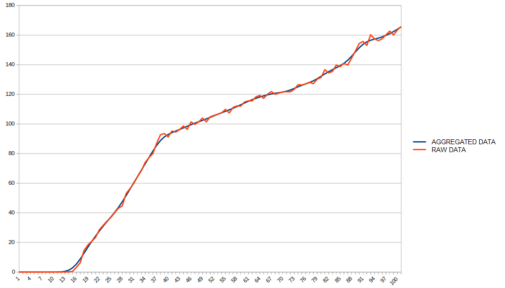
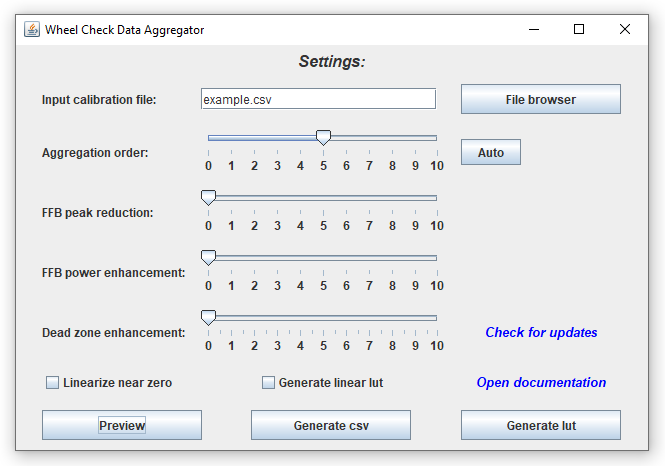
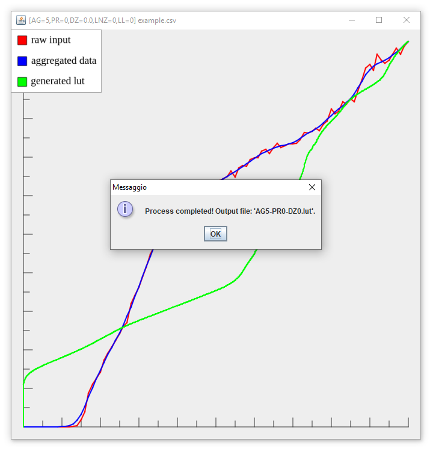
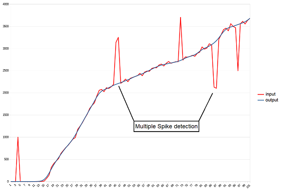
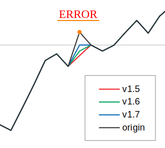
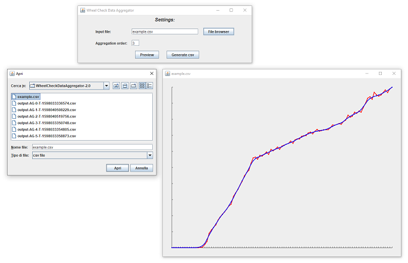

# Download

+ [***Wheel Check Data Aggregator***](https://github.com/Luke460/wheel-check-data-aggregator/releases) ***(latest version)***

---

# Wheel Check Data Aggregator

[***Wheel Check Data Aggregator***](https://github.com/Luke460/wheel-check-data-aggregator/releases) is a useful tool that helps to improve the behavior of your steering wheel by aggregating data and eliminating reading errors, dead zones and clipping problems.

This application is free and open source. The development was born to help the simracers community get the most out of their steering wheels, regardless of the price range of the hardware.

This procedure uses as input a log file generated by ***iRacing force feedback test***, and by processing it, is able to produce either an improved log file or a lookup table.

...but what does it mean? what is data aggregation?

## Data Aggregation example

Data aggregation is a widely used process that helps to extract the behavior of a set of raw data by mitigating reading errors. It's used mostly in advanced security and control systems (sensors networks, alarms). 

In the following graph you can see an example of a generated log file for a ***Logitech G29***. The red line represents the raw data collected by the standard ***iRacing force feedback test*** calibration procedure, while the blue line is the dataset generated by ***Wheel Check Data Aggregator*** used in this example for the generation of a lookup table (or ***lut file***).



## Before to start

In these procedures there is always a remote possibility of damaging your hardware. Only proceed if you are aware of the risk. I take no responsibility for any damage caused by this procedure.

Before to start, you have to execute a calibration procedure by using ***iRacing force feedback test*** (v1.72), a tool made by David Tucker of iRacing.com that measures the change in the steering wheel position for each input applied.
I recommend to execute a ***Step Log 2 (linear force test)*** with ***Max Count*** set to ***100***. Leave all other settings at their default values.

## Let's aggregate!

To run ***Wheel Check Data Aggregator***, download the [***latest version***](https://github.com/Luke460/wheel-check-data-aggregator/releases), unzip the file and run ***WheelCheckDataAggregator.jar*** (requires Java 7 or later):

[](https://github.com/Luke460/wheel-check-data-aggregator/releases)

Now you have to locate your ***iRacing force feedback test***'s log file and configure ***Wheel Check Data Aggregator***.


You can choose between **standard generation** and **linear lut generation**.
 - The **standard generation** uses all the data provided by the csv file to attempt to correct the steering wheel reactions. With this option you can either improve the input csv file or create a lut file. Since ***geared wheels*** tend to have clipping issues that can invalidate *iRacing force feedback test* readings, I highly recommend to choose ***"linear lut generation"*** for this kind of wheel instead.
   
   | **Steering wheel type** | ***Example*** | **Aggregation order**              | **FFB peak reduction** | **FFB power enhancement** | **dead zone enhancement** (depends on your wheel dead zone) |
   |-------------------------|---------------|------------------------------------|------------------------|---------------------------|---------------------------------------------------------------|
   | ***direct wheels***     | Fanatec Podium DD1 and DD2 | 2                                 | 0 | 0                     | 0                                                           |
   | ***belt wheels***       | Thrustmaster T300, T500 or Fanatec CSL elite | 3               | 0 | 0                  | 0                                                           |
   | ***mixed wheels***      | Thrustmaster TXM or T150  | 4                                  | 0 | 0                     | 0                                                           |
   | ***geared wheels***     | Logitech G25, G27, G29, G923 and related XBOX versions | 4     | 0 | 0                    | 0                                                           |

 - The **linear lut generation** uses the csv file only to correct the dead zone in order to not to alter the standard behavior of your steering wheel. With this option you can only generate a lut file.
   
   | **Steering wheel type** | ***Example*** | **Aggregation order**              | **FFB peak reduction** | **FFB power enhancement** | **dead zone enhancement** (depends on your wheel dead zone) |
   |-------------------------|---------------|------------------------------------|------------------------|---------------------------|---------------------------------|
   | ***direct wheels***     | Fanatec Podium DD1 and DD2 | activate option: ***Generate linear lut*** | 0 | 0                      | 5                                                           |
   | ***belt wheels***       |  Thrustmaster T300, T500 or Fanatec CSL elite | activate option: ***Generate linear lut*** | 0 | 0                      | 5                                                           |
   | ***mixed wheels***      | Thrustmaster TXM or T150     | activate option: ***Generate linear lut*** | from 0 to 5 | 0 | 5                                                           |
   | ***geared wheels***     | Logitech G25, G27, G29, G923 and related XBOX versions | activate option: ***Generate linear lut*** | from 0 to 5 | 0 | 5                                                           |

**NOTE:** these tips are based on a test with 100 reading values (*iRacing force feedback test: Max Count=100*). If you are using a higher *Max Count* consider to increment the ***aggregation order*** as well (and vice versa). Every steering wheel is different, you may need to find the perfect *aggregation order* for your device!

 **IN GENERAL** : lower values of ***aggregation order*** makes your force feedback correction more precise, while higher values makes your force feedback smoother.
 - Don't go too high, or you will lose precision in force feedback correction.
 - Don't go too low or you will not benefit of the aggregation procedure.
 - You can click on ***auto*** to (hopefully) calculate a good *aggregation order* for your steering wheel.
 - You can increase ***FFB peak reduction*** if you have clipping issues with your steering wheel or simply you want to reduce the effects of very rough curbs, bumps, strong vibrations, etc. Enabling this option may also slightly reduce the overall noise of your steering wheel and extend its lifespan.
 - You can use ***FFB power enhancement*** to boost your wheel FFB strength. It's mostly intended for steering wheel with low engine power. This option increases the low and medium values of FFB in a progressive manner.
 - You can increase ***dead zone enhancement*** if you have vibrations in the central area of the steering wheel.
 - You can decrease ***dead zone enhancement*** if you still have a FFB deadzone with the generated lut.
 - You can select ***linearize near zero*** to change the aggregation strategy for low values of the force feedback. It can help remove vibrations in the center of some steering wheels. Activating this option requires you to also increase the ***deadzone enhancement*** value.
 - Experiment and play with the ***preview*** button!
 


Now click on ***Generate csv*** or ***Generate lut*** (depending on the purpose for which you will use this application) and if everything goes well, you should get the following output message:



**DONE:** The generated file is located in the *Wheel Check Data Aggregator* folder.

## My personal settings - Logitech G29

The following are the settings I currently use on my personal steering wheel. The in-game FFB gain must be set to 100%.

### Silent mode
This preset is noticeably quieter, although the force feedback is slightly weaker:
 - ***Aggregation order***: disabled (because we are going to make a linear lut)
 - ***FFB Peak reduction***: 5 (this option slightly reduce the overall noise of your steering wheel and extend its lifespan)
 - ***Maximum FFB***: 0
 - ***Dead zone enhancement***: 5 (this value depends on your wheel dead zone, but should be similar to this value)
 - ***Generate linear lut***: selected
 
### Standard mode
This preset offers a good compromise between strength and quietness:
 - ***Aggregation order***: disabled (because we are going to make a linear lut)
 - ***FFB Peak reduction***: 0
 - ***Maximum FFB***: 0
 - ***Dead zone enhancement***: 5 (this value depends on your wheel dead zone, but should be similar to this value)
 - ***Generate linear lut***: selected

### Competitive mode
This preset makes force feedback noticeably stronger, but makes the steering wheel slightly noisy:
 - ***Aggregation order***: disabled (because we are going to make a linear lut)
 - ***FFB Peak reduction***: 0
 - ***Maximum FFB***: 5
 - ***Dead zone enhancement***: 5 (this value depends on your wheel dead zone, but should be similar to this value)
 - ***Generate linear lut***: selected

## How to use LUT files in *Assetto Corsa* and *Assetto Corsa Competizione*

To allow *AC* and *ACC* to use your lut file, you need to create a text file named *ff_post_process.ini*

Here is an example:
```
[HEADER]
VERSION=1
TYPE=LUT
ENABLED=1

[GAMMA]
VALUE=1

[LUT]
CURVE=AG0-PR5-DZ5-LL.lut
```
**NOTE:** You need to set the ***CURVE*** variable with the name of ***your*** LUT file.

Now just place both the .lut file and the .ini file in the following folder:
 - For AC: ```C:\Users\<user_name>\Documents\Assetto Corsa\cfg```
 - For ACC: ```C:\Users\<user_name>\Documents\Assetto Corsa Competizione\Config```
 
 ---
 
## New Features

 - [v1.5](https://github.com/Luke460/wheel-check-data-aggregator/releases): Multiple Spike detection and correction:



- [v1.7](https://github.com/Luke460/wheel-check-data-aggregator/releases): Error correction improvement:



- [v2.0](https://github.com/Luke460/wheel-check-data-aggregator/releases): Added user interface and output graph comparison:



- [v2.2](https://github.com/Luke460/wheel-check-data-aggregator/releases): Added lut generation feature.

- [v2.3](https://github.com/Luke460/wheel-check-data-aggregator/releases): Added 'Auto' button to suggest an aggregation order based on the given csv file.

- [v2.4](https://github.com/Luke460/wheel-check-data-aggregator/releases): Higher lut file output resolution.

- [v2.5](https://github.com/Luke460/wheel-check-data-aggregator/releases): Added 'Dead zone enhancement' option (not needed on most steering wheels).

- [v2.6](https://github.com/Luke460/wheel-check-data-aggregator/releases): Improved 'Dead zone enhancement': slider added.

- [v2.8](https://github.com/Luke460/wheel-check-data-aggregator/releases): Added option to perform dead zone correction only.

- [v2.9](https://github.com/Luke460/wheel-check-data-aggregator/releases): Added 'FFB peak reduction' feature.

- [v2.10](https://github.com/Luke460/wheel-check-data-aggregator/releases): Added 'Linearize near zero' feature.

- [v2.11](https://github.com/Luke460/wheel-check-data-aggregator/releases): Added 'FFB power enhancement' feature.
