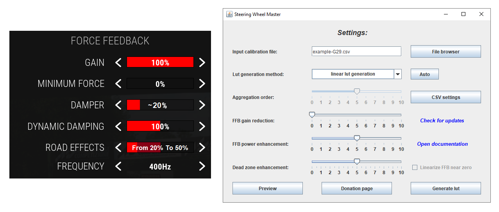
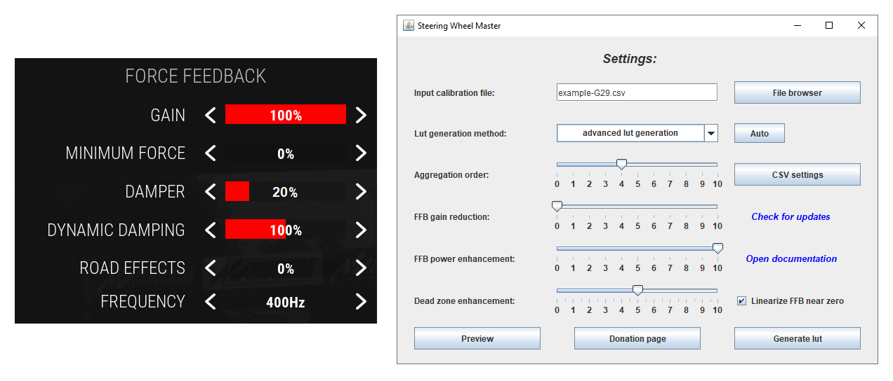
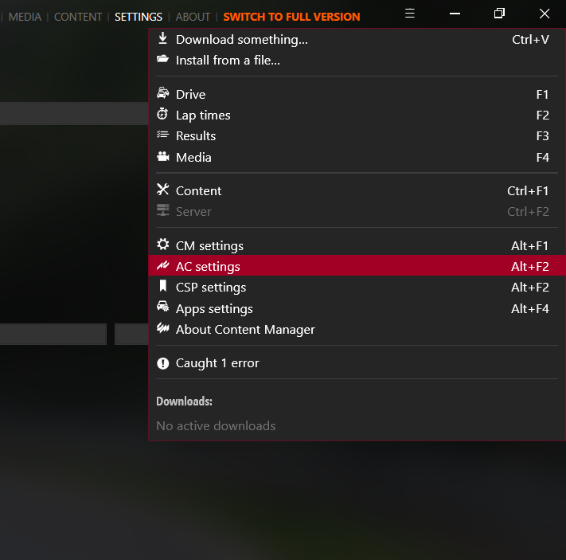
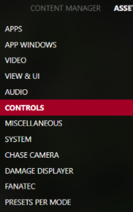
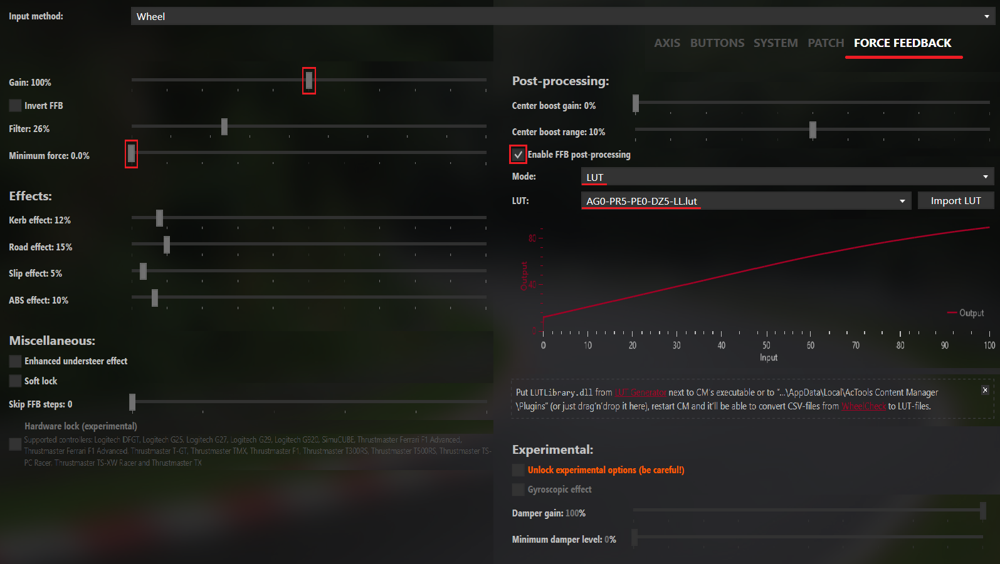

## Download

+ [***Steering Wheel Master***](https://github.com/Luke460/steering-wheel-master/releases) ***(latest version)***

## Donate

Donations are not required, but always accepted with pleasure. Thanks for your support!
 - [***Go to the donation page***](https://www.paypal.com/donate?hosted_button_id=WVSY5VX8TA4ZE)

---

# Steering Wheel Master

[***Steering Wheel Master***](https://github.com/Luke460/steering-wheel-master/releases) is a useful tool that helps to improve the behavior of your steering wheel by aggregating data and eliminating reading errors, dead zones and clipping problems.

This application is free and open source. The development was born to help the simracers community get the most out of their steering wheels, regardless the price range of the hardware.

This procedure uses as input a ***force feedback calibration file***, and by processing it, is able to produce a customizable lookup table (or ***lut file***).

...but what does it mean? what is data aggregation?

## Data Aggregation example

Data aggregation is a widely used process that helps to extract the behavior of a set of raw data by mitigating reading errors. It's used mostly in advanced security and control systems (sensors networks, alarms). 

In the following chart you can see an example of a generated log file for a ***Logitech G29***. The red line represents the raw data, while the blue line is the dataset generated by ***Steering Wheel Master*** used in this example for the generation of a lookup table (or ***lut file***).


## Before to start

In these procedures there is always a remote possibility of damaging your hardware. Only proceed if you are aware of the risk. I take no responsibility for any damage caused by this procedure.

Before to start, you have to create a ***force feedback calibration file*** for your own steering wheel. Depending on the program you intend to use, you need to properly set the *force column index* and the *delta column index* in the ***CSV settings*** menu.

In this example my input csv file was generated by using ***iRacing force feedback test*** (v1.72), a tool made by David Tucker of iRacing.com that measures the change in the steering wheel position for each input applied.
The used settings are ***Step Log 2 (linear force test)*** with ***Max Count*** set to ***100***.

## How to use

To run ***Steering Wheel Master***, download the [***latest version***](https://github.com/Luke460/steering-wheel-master/releases), unzip the file and run ***SteeringWheelMaster.jar*** (requires Java 8 or later):

[](https://github.com/Luke460/steering-wheel-master/releases)

Now you have to locate your ***force feedback calibration file*** and configure ***Steering Wheel Master***.


First of all, you have to choose between **advanced lut generation** and **linear lut generation**:
 - **advanced lut generation** uses all the data provided by the csv file to attempt to correct the steering wheel reactions. The accuracy of the correction depends on the used calibration tool.
 - **linear lut generation** [recommended mode] uses the csv file only to correct the dead zone in order to not alter the standard behavior of your steering wheel.
 
 In both cases you can also customize the FFB curve according to your personal preferences.
   
   | **Steering wheel type** | **Steering wheel name** | **Lut generation method** | **Aggregation order** | ***Linearize FFB near zero*** | **FFB gain reduction** | **FFB power enhancement** | **Dead zone enhancement** (depends on your steering wheel) |
   |-------------------------|---------------------------|----|----|----|----|----|----|
   | ***direct drive*** | Fanatec CLS DD, Podium | advanced | auto | false | 0 | from 0 to 5 | - |
   |                         |                                             | linear | - | - | 0 | 0 | ~2 |
   | ***belt***       | Thrustmaster T300, T500, Fanatec CSL elite | advanced | auto | false | 0 | from 0 to 10 | - |
   |                         |                                             | linear | - | - | 0 | 0 | ~5 |
   | ***mixed***      | Thrustmaster TXM, T150, T248  | advanced | auto | true/false | 0 | from 5 to 10 | ~5 |
   |                         |                           | linear | - | - | 0 | 0 | ~5 |
   | ***geared***     | Logitech G25, G27, G29, G923 (and related XBOX versions) | advanced | auto | true | 0 | from 5 to 10 | ~5 |
   |                         |                     | linear | - | - | 0 | 0 | ~5 |

**NOTE:** 
 - Keep in mind that every steering wheel is different, you may need to find the perfect settings for your own device!
 - The in-game **FFB gain** must be set to 100% and the **minimum FFB** must be set to 0% to ensure the best FFB dead zone correction. If you need to reduce the ***gain*** in the game, you may need to decrease the ***dead zone enhancement*** slider as well.
 - Make sure to also disable the ***centering force*** of your steering wheel if present.
 - If you are using a high level steering wheel (like a ***direct drive***), you probably will not get any benefit by using this application, as its behavior will already be linear, silent and without any dead zone, but you can use the application to customize the ffb curve according to your needs.

 **IN GENERAL:** 
 - Lower values of ***aggregation order*** makes your force feedback correction more precise, while higher values makes your force feedback correction smoother.
   - Don't go too high, or you will lose precision in force feedback correction.
   - Don't go too low otherwise you will not benefit of the aggregation procedure.
 - You can click on ***auto*** to generate a set of valid settings for your steering wheel. It works for both linear and advanced lut generation.
 - You can click on ***CSV settings*** to configure how to read the input csv file.
 - You can increase ***FFB gain reduction*** to reduce the maximum amount of force sent to your steering wheel in a progressive manner.
 - You can use ***FFB power enhancement*** to boost your wheel FFB strength. This option increases the low and medium values of FFB in a progressive manner by modifying the FFB curve.
 - You can increase ***dead zone enhancement*** if you have vibrations in the central area of the steering wheel.
 - You can decrease ***dead zone enhancement*** if you still have an FFB dead zone with the generated lut.
 - You can select ***linearize FFB near zero*** to improve the force feedback for steering wheels with a noticeable dead zone. Enabling this option requires adjustment of the ***dead zone enhancement*** value.
 - Experiment and play with the ***preview*** button!
 
**NOTE:** The following settings are NOT recommended for the G29. More presets in the following sections.
 


Now click on ***Generate lut*** and if everything goes well, you should get the following output message:


**DONE:** The generated file is located in the *Steering Wheel Master* folder.

## Lut generation presets

The following settings can be applied to every steering wheel. The in-game **FFB gain** must be set to 100% and the **minimum FFB** must be set to 0% to ensure the best FFB dead zone correction. If you need to reduce the gain in the game, you may need to decrease the ***dead zone enhancement*** slider as well. Make sure to also disable the centering force of your steering wheel if present.

### Standard mode (dead zone correction only)
This is the standard preset and offers a good compromise between strength and quietness. Basically it only removes the dead zone leaving a linear behavior.
 - ***Lut generation method***: linear lut generation
 - ***FFB Gain reduction***: 0
 - ***FFB power enhancement***: 0
 - ***Dead zone enhancement***: this value depends on your wheel dead zone, refer to the previous section.

### Advanced mode
This preset uses all the data provided by the csv file to attempt to correct the steering wheel reactions. This preset should maximize the fidelity of your FFB response.
 - ***Lut generation method***: advanced lut generation
 - ***Aggregation value***: auto
 - ***Linearize FFB near zero***: true for steering wheels with a noticeable dead zone, false otherwise.
 - ***FFB Gain reduction***: 0
 - ***FFB power enhancement***: from 0 to 10 (depends on the steering wheel power: 10 for weak steering wheels like the G29, 0 for a DD).
 - ***Dead zone enhancement***: this value depends on your wheel dead zone, refer to the previous section.
 
### Competitive mode
This preset makes force feedback noticeably stronger (but makes the steering wheel slightly noisy and less linear) by increasing the low and medium values of FFB in a progressive manner. Keep in mind that the maximum peak force is always limited to 100%.
 - ***Lut generation method***: linear lut generation
 - ***FFB Gain reduction***: 0
 - ***FFB power enhancement***: 5
 - ***Dead zone enhancement***: this value depends on your wheel dead zone, refer to the previous section.

## My settings (Logitech G29)

### Linear (recommended settings)


### Advanced


## How to use LUT files in *Assetto Corsa* and *Assetto Corsa Competizione*

To allow *AC* and *ACC* to use your lut file, you need to create a text file named *ff_post_process.ini*

Here is an example:
```
[HEADER]
VERSION=1
TYPE=LUT
ENABLED=1

[GAMMA]
VALUE=1

[LUT]
CURVE=NAME-OF-YOUR-LUT-FILE.lut
```
**NOTE:** You need to set the ***CURVE*** variable with the name of ***your*** LUT file.

Now just place both the .lut file and the .ini file in the following folder:
 - For AC: ```C:\Users\<user_name>\Documents\Assetto Corsa\cfg```
 - For ACC: ```C:\Users\<user_name>\Documents\Assetto Corsa Competizione\Config```

## How to use LUT files in *Assetto Corsa* with Content Manager

For Assetto Corsa, if you are using ***Content Manager*** as game launcher, you need to use its interface to set up your lut file as follows:





---
 
## New Features

 - [v1.5](https://github.com/Luke460/steering-wheel-master/releases): Multiple Spike detection and correction:


- [v1.7](https://github.com/Luke460/steering-wheel-master/releases): Error correction improvement:


- [v2.0](https://github.com/Luke460/steering-wheel-master/releases): Added user interface and output graph comparison:


- [v2.2](https://github.com/Luke460/steering-wheel-master/releases): Added lut generation feature.

- [v2.3](https://github.com/Luke460/steering-wheel-master/releases): Added 'Auto' button to suggest an aggregation order based on the given csv file.

- [v2.4](https://github.com/Luke460/steering-wheel-master/releases): Higher lut file output resolution.

- [v2.5](https://github.com/Luke460/steering-wheel-master/releases): Added 'Dead zone enhancement' option.

- [v2.6](https://github.com/Luke460/steering-wheel-master/releases): Improved 'Dead zone enhancement': slider added.

- [v2.8](https://github.com/Luke460/steering-wheel-master/releases): Added option to perform dead zone correction only.

- [v2.9](https://github.com/Luke460/steering-wheel-master/releases): Added 'FFB peak reduction' feature.

- [v2.10](https://github.com/Luke460/steering-wheel-master/releases): Added 'Linearize near zero' feature.

- [v2.11](https://github.com/Luke460/steering-wheel-master/releases): Added 'FFB power enhancement' feature.

- [v2.12](https://github.com/Luke460/steering-wheel-master/releases): Added tooltips in the user interface.

- [v2.13](https://github.com/Luke460/steering-wheel-master/releases): Improved input csv files compatibility.

- [v3.0](https://github.com/Luke460/steering-wheel-master/releases): A new name: Steering Wheel Master!

- [v3.1](https://github.com/Luke460/steering-wheel-master/releases): Improved default settings. Java 8 is now required.

- [v3.2](https://github.com/Luke460/steering-wheel-master/releases): Improved 'Auto' function for both linear and advanced modes.

- [v3.3](https://github.com/Luke460/steering-wheel-master/releases): Improved 'FFB Peak Reduction' and 'FFB Power Enhancement' functions.

- [v3.4](https://github.com/Luke460/steering-wheel-master/releases): Rewritten the entire calculation algorithm for maximum accuracy.

- [v3.5](https://github.com/Luke460/steering-wheel-master/releases): Multiple input csv selection to maximize accuracy.
