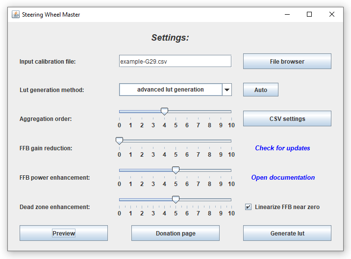

# Wheel Check Data Aggregator

[***Wheel Check Data Aggregator***](https://github.com/Luke460/wheel-check-data-aggregator/releases) is a useful tool that helps to improve the behavior of your steering wheel by aggregating data and eliminating reading errors.

This procedure use as input a log file generated by [***Wheel check***](https://www.racedepartment.com/downloads/lut-generator-for-ac.9740/), and by processing it, is able to produce an improved log file or directly an improved ***lut file***.

...but what does it mean? what is data aggregation?

## Data Aggregation example (with Logitech G29)

Data aggregation is a widely used process that helps to extract the behavior of a set of raw data by mitigating reading errors. It's used mostly in advanced security and control systems (sensors networks, alarms). 

In the following graph you can see an example of a generated log file for a ***Logitech G29***. The red line represents the raw data collected by the standard [***Wheel check***](https://www.racedepartment.com/downloads/lut-generator-for-ac.9740/) calibration procedure, while the blue line is the dataset generated by ***Wheel Check Data Aggregator*** used for the generation of an improved lookup table (or ***lut file***).

To run the utility, just execute [***WheelCheckDataAggregator.jar***](https://github.com/Luke460/wheel-check-data-aggregator/releases):

Now you have to locate your [***Wheel check***](https://www.racedepartment.com/downloads/lut-generator-for-ac.9740/)'s log file and choose the degree of data aggregation (named ***aggregation order***):

 - For ***geared wheels*** - like Logitech G29 or G27 - I suggest 4 or 5 as aggregation order (5 is perfect in my case).
 - For ***mixed wheels*** - like Thrustmaster TXM or T150 - I suggest 3 or 4.
 - For ***belt wheels*** and ***direct wheels*** - like Thrustmaster T300 - I suggest a lower value like 3.

 Every steering wheel is different, you may need to find the perfect aggregation value for your device!
 
 **IN GENERAL** : lower values makes your lut file more similar to the standard lut generation procedure, while higher values makes your lut smoother. 
 - Don't go too high, or you will lose precision in lut correction.
 - Don't go too low or you will not benefit of the aggregation procedure.
 - Recommended values are between 2 and 6. (3 is always a good starting point).
 - Experiment and play with the *preview* button!
 

 
**NOTE:** these tips are based on a test with 100 reading values (*Wheel check: Max Count=100*). If you are using a higher *Max Count* consider to increment the ***aggregation order*** as well (and vice versa).

Now click on ***Generate lut*** and if everything goes well, you should get the following output message:

**DONE:** The generated file is located in the *Wheel Check Data Aggregator* folder.

---

You can also use generated csv files as [***LUT Generator for AC***](https://www.racedepartment.com/downloads/lut-generator-for-ac.9740/) input, but from version v2.2 you can directly generate your lut file from ***Wheel Check Data Aggregator***.

Keep in mind that my algoritm may not be the same, so the result may change a little as well.

## DOWNLOADS

 + [***Wheel Check Data Aggregator***](https://github.com/Luke460/wheel-check-data-aggregator/releases) ***(latest version)***
 
 ---
 
## New Features

 - [v1.5](https://github.com/Luke460/wheel-check-data-aggregator/releases): Multiple Spike detection and correction:

- [v1.7](https://github.com/Luke460/wheel-check-data-aggregator/releases): Error correction improvement:

- [v2.0](https://github.com/Luke460/wheel-check-data-aggregator/releases): Added user interface and output graph comparison:

- [v2.2](https://github.com/Luke460/wheel-check-data-aggregator/releases): Added direct lut generation feature.
